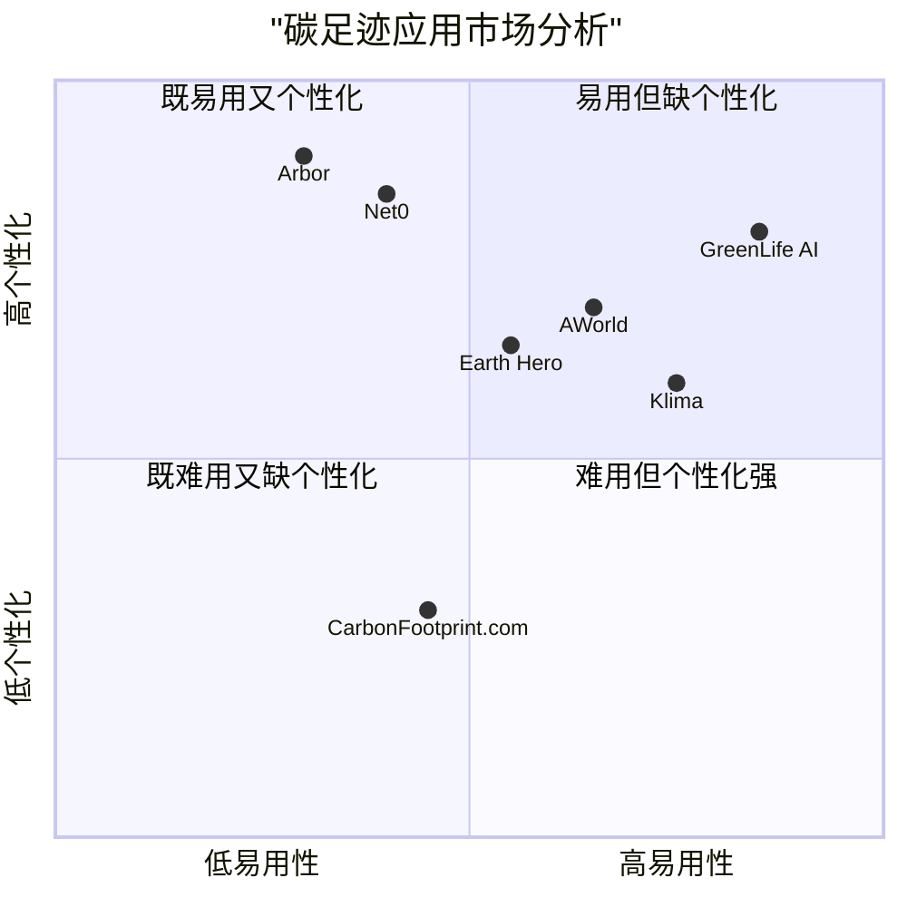

# GreenLife AI - 产品需求文档 (PRD)

## 1. 项目概要

### 1.1 项目背景

GreenLife AI 是一个基于网络的可持续性规划工具，利用 AI 和多代理协作框架，帮助用户计算个人碳足迹并提供个性化的环保行动计划。应用旨在提高用户的环保意识，同时在 2025 年 4 月（地球日期间）吸引广泛关注，以达到在 Product Hunt 获奖和在社交平台（如 X）上获得病毒式传播的潜力。

### 1.2 项目目标

1. **实用性目标**：帮助用户快速、准确地计算个人碳足迹，并提供具体可操作的环保建议。
2. **参与度目标**：通过交互式图表和可分享报告，增强用户参与度和社交传播力。
3. **创新性目标**：结合 AI 和环保领域，打造一个既创新又实用的工具。

### 1.3 成功指标

- **用户参与**：首月 5000+ 用户完成碳足迹计算，1000+ 分享到 X 平台
- **Product Hunt 表现**：获得 1000+ 投票，评分 > 4.5/5，进入每日前 3
- **社区影响**：用户总计减少 500 吨 CO2（通过建议实施估算）

## 2. 用户分析

### 2.1 目标用户群体

#### 主要用户
1. **环保意识强的个人**
   - 年龄：18-45 岁
   - 特点：关注气候变化和可持续生活方式
   - 需求：了解自己的环境影响并寻找改进方法

2. **技术爱好者**
   - 特点：喜欢尝试 AI 驱动的工具，活跃于 Product Hunt 和 X 平台
   - 需求：体验创新技术，分享有趣的发现

3. **学生和教育工作者**
   - 特点：需要计算碳足迹用于学习或教学项目
   - 需求：获取准确的数据和教育资源

### 2.2 用户场景

#### 用户故事 1：环保意识人士 Alex
作为一个环保意识强的个人，我希望能够准确计算我的碳足迹，以便了解我的生活方式对环境的影响，并找到减少这种影响的方法。

#### 用户故事 2：技术爱好者 Morgan
作为一个技术爱好者，我想尝试最新的 AI 工具来分析我的碳足迹，并在社交媒体上分享我的发现，以此鼓励我的朋友也关注环保问题。

#### 用户故事 3：大学生 Taylor
作为一名环境科学专业的学生，我需要计算和分析我的碳足迹作为课堂项目的一部分，并基于数据制定个人可持续发展计划。

## 3. 市场分析

### 3.1 竞品分析

#### Klima
- **优势**：设计精美，Apple Design Award 获奖者，提供多达 48 个生活方式问题
- **劣势**：主要关注碳抵消而非行为改变，缺乏详细的教育内容

#### AWorld
- **优势**：Google 最佳应用获奖者，强大的社区和团队功能，游戏化元素
- **劣势**：界面复杂，可能对新用户不够友好，定制化建议不足

#### Net0
- **优势**：提供 50+ 微产品，适合企业使用，强大的集成能力
- **劣势**：主要面向企业用户，个人用户体验不佳，价格较高

#### Arbor
- **优势**：全面的碳核算，支持法规报告，整合 PLM 系统
- **劣势**：专注于产品碳足迹，对个人用户不够友好，起价 $100/月

#### CarbonFootprint.com
- **优势**：免费服务，覆盖多种生活方式因素
- **劣势**：用户界面过时，缺乏吸引力，数据可视化简单

#### Earth Hero
- **优势**：全面的碳足迹计算器，提供定制化的可持续生活计划
- **劣势**：社交分享功能有限，用户参与度不高

### 3.2 竞争优势分析

### 3.3 市场机会

1. **个性化差距**：现有应用通常提供通用建议，而非基于用户具体数据的个性化建议
2. **社交整合**：大多数碳足迹计算器缺乏强大的社交分享功能
3. **教育与行动的平衡**：许多应用要么过于教育性，要么过于行动导向，缺乏平衡
4. **地球日时机**：2025年4月地球日提供了完美的市场推广时机
5. **AI 技术创新**：大多数竞品尚未充分利用最新的 AI 技术提升用户体验

## 4. 产品功能需求

### 4.1 核心功能

#### 4.1.1 碳足迹计算器

**必须实现 (P0)**
- 用户输入界面，包含以下数据收集：
  - 旅行：年飞行次数、汽车里程（公里/年）、公共交通使用（公里/年）
  - 能源使用：家庭用电量（千瓦时/月）、是否使用可再生能源（是/否）
  - 消费习惯：饮食类型（素食/杂食）、购物频率（每周几次）
- 基于 Global Footprint Network 方法的计算逻辑
- 结果展示：用户总碳足迹与全球平均值（约 4 吨 CO2/年/人）的对比

**应该实现 (P1)**
- 默认值预填充，减少用户输入负担
- 更详细的输入选项，提高计算准确性
- 地区特定的排放因子调整

**可以实现 (P2)**
- 输入数据的保存功能，允许用户稍后继续
- 更多碳足迹来源的细分（如电子设备使用、水资源消耗）

#### 4.1.2 个性化环保建议

**必须实现 (P0)**
- 基于用户输入生成 3-5 条可操作建议
- 每条建议附带预计减少的碳排放量
- 建议按照实施难度和影响程度排序

**应该实现 (P1)**
- 建议可展开，显示更详细的实施步骤
- 本地化建议，考虑用户所在地区的特定情况

**可以实现 (P2)**
- 建议的收藏功能，让用户标记感兴趣的建议
- 建议实施的时间表和提醒功能

#### 4.1.3 交互式可视化

**必须实现 (P0)**
- 碳足迹分布饼图，展示不同来源的占比
- 实施建议前后的碳足迹对比柱状图
- 图表的基本交互功能，如悬停查看详细数据

**应该实现 (P1)**
- 更多图表类型，如雷达图比较用户与平均水平的差异
- 动态图表，展示随时间变化的碳足迹趋势

**可以实现 (P2)**
- 自定义图表功能，允许用户选择要比较的变量
- 图表导出功能，支持常见图像格式

#### 4.1.4 可分享报告

**必须实现 (P0)**
- 生成 PDF 格式的报告，包含用户碳足迹数据、分布和建议
- 一键分享按钮，支持直接分享到 X 平台

**应该实现 (P1)**
- 报告模板选择，提供不同的样式和布局
- 分享到其他社交媒体平台（如 Instagram, Facebook）

**可以实现 (P2)**
- 可自定义报告内容，允许用户选择要包含的部分
- 报告的交互式在线版本，可通过链接分享

### 4.2 附加功能

#### 4.2.1 用户账户系统

**应该实现 (P1)**
- 用户注册/登录功能
- 用户数据保存和历史记录
- 个人资料设置和偏好管理

**可以实现 (P2)**
- 社交媒体账号关联登录
- 用户隐私设置和数据管理

#### 4.2.2 社区挑战

**应该实现 (P1)**
- "地球日挑战"活动，用户承诺减少碳足迹
- 社区总减排量的实时显示

**可以实现 (P2)**
- 数字徽章和成就系统
- 用户排行榜和竞争机制

#### 4.2.3 多语言支持

**应该实现 (P1)**
- 支持英语、西班牙语和法语

**可以实现 (P2)**
- 额外语言支持（如中文、德语、葡萄牙语等）
- 语言自动检测功能

## 5. 用户体验设计

### 5.1 用户旅程

#### 5.1.1 首页

- **内容**:
  - 欢迎标题："计算你的碳足迹，开启绿色生活！🌍"
  - "立即开始"按钮，引导用户进入数据输入页面
  - 社区影响展示（例如，"已有 5000+ 用户减少了 2000 吨 CO2"）
  - 简短的产品介绍和价值主张

- **设计要点**:
  - **布局**: 采用 Apple 风格的居中对齐布局，大量留白。背景采用高质量、模糊化的自然风光图片（如森林、海洋），营造宁静环保氛围。
  - **元素**:
    - **标题**: 使用 Montserrat Bold 字体，字号大，醒目突出。
    - **"立即开始" 按钮**: 采用磨砂玻璃 (frosted glass) 效果，圆角设计，配有微妙的光泽和阴影，增加立体感。悬停时有轻微放大和亮度提升效果，点击时有内缩动画。
    - **社区影响**: 使用 Open Sans Light 字体，简洁展示，数字部分可略微加粗。元素加载时使用柔和的淡入动画。
  - **动画**: 页面加载时，各元素（标题、描述、按钮、统计）以错落有致的顺序、平滑地淡入并轻微上移。
  - **响应式**: 在移动端保持简洁，按钮尺寸适合触摸。背景模糊效果根据屏幕尺寸调整。

#### 5.1.2 数据输入页面

- **内容**:
  - 分步骤表单，划分为 3 个部分（旅行、能源、消费）
  - 每部分包含 2-3 个关键问题
  - 提供默认值和提示信息
  - 顶部固定进度条显示完成度

- **设计要点**:
  - **布局**: 采用卡片式设计，每个步骤（旅行、能源、消费）是一个独立的磨砂玻璃卡片，卡片之间有足够的间距。背景延续首页的模糊自然图片。顶部进度条采用细长设计，填充动画平滑。
  - **元素**:
    - **输入控件**: 滑块、单选按钮、数字输入框均采用简约现代设计，边框纤细，选中状态有清晰视觉反馈（如颜色变化或边框高亮）。滑块可采用磨砂玻璃材质的滑轨和控制点。
    - **帮助图标**: 放置在标签旁边，悬停时弹出磨砂玻璃背景的 Tooltip，解释说明，弹出动画流畅。
    - **表单验证**: 输入错误时，输入框边框变为强调色（珊瑚红），并伴有轻微的左右震动动画。提示信息出现在输入框下方。
    - **导航按钮**: "下一步" 和 "上一步" 按钮置于卡片底部或屏幕底部固定区域，设计风格与 "立即开始" 按钮类似，但可能尺寸稍小或视觉权重稍低。
  - **动画**: 步骤切换时，使用平滑的横向滑动或淡入淡出过渡动画。控件获取焦点时有细微的缩放或阴影变化。

#### 5.1.3 结果页面

- **内容**:
  - 顶部显著区域显示总碳足迹数值和与全球平均值的对比。
  - 交互式图表区域（饼图展示分布，柱状图展示前后对比）。
  - 个性化建议列表，以卡片形式展示，每条可展开查看详情。
  - "生成报告" 和 "分享到 X" 按钮。

- **设计要点**:
  - **布局**: 采用网格或垂直堆叠布局，信息层级分明。顶部结果区域背景可使用微妙的磨砂玻璃效果或渐变色，突出核心数据。
  - **元素**:
    - **核心数据**: 总碳足迹数值使用大号 Montserrat 字体，颜色醒目。对比信息（如低于/高于平均值百分比）在旁边清晰展示。
    - **图表 (Chart.js)**: 图表背景透明或使用轻微磨砂玻璃效果。配色方案与整体风格协调，使用预设的环保色系。交互（如图例悬停、数据点高亮）动画流畅，Tooltip 采用磨砂玻璃背景。
    - **建议卡片**: 每条建议是一个磨砂玻璃卡片，包含标题、预计减排量和难度指示。卡片可点击展开，展开动画使用平滑的高度变化和内容淡入效果。
    - **行动按钮**: "生成报告" 和 "分享到 X" 按钮采用与首页一致的磨砂玻璃风格，并排放置，具有清晰的图标和文字。
  - **动画**: 页面加载时，核心数据、图表、建议卡片依次带有动效（如数字滚动、图表绘制动画、卡片淡入）加载。

#### 5.1.4 报告页面

- **内容**:
  - PDF 报告预览区域。
  - 下载按钮。
  - 社交媒体分享选项 (X 平台为主)。
  - 返回结果页面的链接或按钮。

- **设计要点**:
  - **布局**: 页面主体为报告预览区，侧边或下方放置操作按钮。
  - **元素**:
    - **PDF 预览**: 预览区提供清晰的报告缩略图或嵌入式预览，可带有细微的内阴影增加层次感。
    - **下载/分享按钮**: 采用磨砂玻璃设计，图标清晰。下载按钮在点击后可显示进度指示（如环形进度条）。
    - **分享选项**: X 平台分享按钮突出显示，其他平台（若 P1 实现）可折叠或以次要样式展示。
    - **反馈**: 下载完成或分享成功后，显示磨砂玻璃风格的 Toast 通知，从屏幕边缘滑入并自动淡出。
  - **动画**: 加载预览时有占位符或加载指示器。按钮交互、进度显示、通知弹出/消失均有平滑过渡动画。

### 5.2 设计原则

#### 5.2.1 视觉设计

- **配色方案**:
  - 主色调：环保绿色 (#2E8B57) 和湖水蓝 (#5F9EA0)，用于主要元素和背景点缀。
  - 强调色：珊瑚红 (#FF7F50)，用于重要的行动号召（CTA）按钮、错误提示或需要用户注意的地方。
  - 中性色：不同透明度的白色和深灰 (#343A40) 用于文本和磨砂玻璃元素的背景，通过透明度和模糊度营造深度。
  - **玻璃拟态 (Glassmorphism)**: 广泛应用于卡片、按钮、模态框、Tooltip 等元素的背景。具有背景模糊、半透明、微妙边框和光泽效果。

- **排版**:
  - 字体选择：标题使用 Montserrat (Bold, SemiBold)，正文使用 Open Sans (Regular, Light)。注重字重、字号和行高的组合，创造清晰的视觉层级和优良的可读性，保持 Apple 风格的简洁感。
  - 留白：充分利用空白区域，避免信息拥挤，引导视觉焦点。

- **图标与插图**:
  - 图标：采用线条简洁、表意清晰的图标（类 SF Symbols 风格），保持视觉一致性。
  - 插图/背景：使用高质量、与环保主题相关的抽象或具象图片作为背景，并进行高斯模糊处理以配合玻璃拟态效果。

#### 5.2.2 交互设计

- **微交互**:
  - **状态变化**: 按钮悬停、点击、禁用状态，输入框聚焦、错误状态等，均有平滑的视觉过渡（颜色、大小、阴影、模糊度变化）。
  - **加载指示**: 使用优雅的加载动画（如旋转器、进度条）而非静态文字，图表加载时有绘制动画。
  - **物理隐喻**: 动画（如 Framer Motion 实现）遵循一定的物理规律，感觉自然不生硬（如轻微弹性、缓入缓出）。
  - **触觉反馈 (可选)**: 在移动端，关键操作（如按钮点击、滑块到位）可考虑加入轻微震动反馈。

- **导航**:
  - 页面切换：采用平滑的淡入淡出或轻微的滑动过渡效果。
  - 进度指示：进度条填充动画流畅，步骤切换清晰。
  - 返回逻辑：提供清晰的返回按钮或手势（移动端），确保用户随时可以回到上一步或主页。

- **反馈机制**:
  - **即时性**: 操作结果（成功、失败、警告）通过视觉元素（如 Toast 通知、状态图标）即时反馈给用户。
  - **清晰度**: 反馈信息简洁明了，易于理解。错误提示应指出问题所在并提供解决方案建议。
  - **非干扰性**: 反馈（尤其是成功提示）应尽量不打断用户当前流程，如使用自动消失的 Toast。

#### 5.2.3 响应式设计

- **桌面端**:
  - 最大利用屏幕空间，展示更多信息
  - 并排布局，便于信息比较
  - 支持键盘快捷键

- **平板端**:
  - 调整布局以适应中等屏幕
  - 优化触摸目标大小
  - 保持关键功能的可见性

- **移动端**:
  - 单列布局，优先展示核心内容
  - 折叠次要信息，按需展开
  - 适配触摸操作，增大交互元素

## 6. 技术规格

### 6.1 前端技术栈

- **框架**: React
- **样式**: Tailwind CSS
- **状态管理**: Redux
- **图表库**: Chart.js
- **动画**: Framer Motion
- **UI 组件库**: 基于 Carbon Design System

### 6.2 后端需求

- **数据存储**: Firebase
- **认证系统**: Firebase Authentication
- **API 集成**:
  - Carbon Intensity API 获取排放因子
  - PDF 生成 API (如 jsPDF)
  - X 平台分享 API

### 6.3 AI 能力

- **多代理协作**:
  - 产品经理代理：定义用户旅程和功能优先级
  - 架构师代理：设计技术架构
  - 工程师代理：生成前端代码和后端逻辑
  - 数据分析师代理：实现碳足迹计算逻辑和建议算法

- **算法逻辑**:
  - 用户输入解析：提取旅行、能源、消费数据
  - 碳足迹计算：基于排放因子计算总值和分布
  - 建议生成：根据高排放领域，匹配预定义建议模板
  - 可视化生成：将数据转换为图表格式
  - 报告生成：整合数据、图表和建议，生成 PDF

### 6.4 性能要求

- **加载时间**: 页面加载时间 < 2 秒，图表渲染 < 1 秒
- **响应速度**: 用户操作响应时间 < 0.1 秒
- **并发处理**: 支持同时 1000 用户访问，计算延迟 < 500 毫秒
- **移动兼容性**: 支持最新版本的 iOS 和 Android 浏览器
- **浏览器兼容性**: 支持 Chrome、Firefox、Safari、Edge 等主流浏览器的最新版本

## 7. 数据安全与隐私

### 7.1 数据收集

- 明确告知用户收集的数据类型和用途
- 只收集必要的个人数据，避免过度收集
- 提供数据收集的选择退出选项

### 7.2 数据存储

- 使用加密技术保护用户数据
- 定期备份数据，防止数据丢失
- 设置数据保留期限，不必要时删除数据

### 7.3 隐私政策

- 清晰说明用户数据的使用方式
- 说明第三方数据共享（如有）的范围和目的
- 告知用户他们的隐私权利和选择

## 8. 开发与上线计划

### 8.1 开发优先级

#### 8.1.1 MVP（最简可行产品，1 周内完成）

- **核心功能**:
  - 碳足迹计算器（基本输入字段）
  - 个性化建议（3条基本建议）
  - 简单饼图和柱状图
  - 基本 PDF 报告生成
  - X 平台分享功能

- **基本界面**:
  - 首页
  - 数据输入页面
  - 结果页面
  - 简单报告页面

- **其他**:
  - 英语版本
  - 桌面端优先的响应式设计

#### 8.1.2 第二阶段（2-3 周）

- **功能扩展**:
  - 用户账户系统
  - 历史数据保存
  - 社区挑战（地球日挑战）
  - 更丰富的建议库
  - 更多交互式图表

- **体验优化**:
  - 添加微交互和动画
  - 完善移动端体验
  - 多语言支持（西班牙语和法语）

#### 8.1.3 第三阶段（长期）

- **高级功能**:
  - 社区功能和用户互动
  - 数字徽章和成就系统
  - 更多语言支持
  - API 集成扩展
  - 移动应用版本开发

### 8.2 测试计划

#### 8.2.1 功能测试

- 碳足迹计算器的计算准确性
- 建议生成的相关性和有用性
- 图表渲染和交互功能
- PDF 报告生成和下载
- 社交媒体分享功能

#### 8.2.2 用户体验测试

- 通过 5-8 名代表性用户进行可用性测试
- 收集关于导航流程、输入表单和结果展示的反馈
- 测试不同设备和屏幕尺寸的响应式设计

#### 8.2.3 性能测试

- 页面加载时间测试
- 并发用户访问测试
- 移动设备性能测试
- 跨浏览器兼容性测试

### 8.3 上线时间线

- **2025 年 2 月**: MVP 版本完成和内部测试
- **2025 年 3 月初**: 封闭 beta 测试，邀请 100 名用户参与
- **2025 年 3 月底**: 修复 bug 和优化，实施第二阶段功能
- **2025 年 4 月 15 日**: 正式发布，配合地球日（4 月 22 日）营销活动
- **2025 年 5 月**: 收集用户反馈，进行首次迭代更新
- **2025 年第三季度**: 开始实施第三阶段功能

## 9. 营销与推广

### 9.1 发布策略

- 配合 2025 年地球日（4 月 22 日）进行产品发布
- 在 Product Hunt 上发布，争取成为当日热门产品
- 在 X 平台发起 #GreenLifeChallenge 话题，鼓励用户分享

### 9.2 用户获取渠道

- **社交媒体**：在 X、Instagram、LinkedIn 建立品牌存在
- **内容营销**：发布环保主题的博客文章和信息图
- **影响者合作**：与环保领域的关键意见领袖合作
- **SEO/SEM**：优化网站关键词，投放有针对性的广告

### 9.3 用户留存策略

- 定期更新建议库，保持内容新鲜度
- 发送个性化邮件，提醒用户查看碳足迹变化
- 通过社区挑战和成就系统增强用户参与度
- 收集用户反馈，持续改进产品体验

## 10. 开放问题与决策点

1. **数据精确性平衡**：如何在简化用户输入和提高计算准确性之间取得平衡？
2. **个性化算法**：如何确保建议足够个性化且实用？
3. **用户参与度**：如何设计激励机制，保持用户长期参与？
4. **数据来源**：如何确保计算中使用的排放因子是最新且准确的？
5. **营销策略**：如何最大化地球日期间的曝光效果？

## 附录

### A. 碳排放计算方法

基于 Global Footprint Network 的方法，主要排放因子包括：

- 飞行：每公里 0.24 千克 CO2
- 汽车：每公里 0.12 千克 CO2
- 家庭用电：每千瓦时 0.5 千克 CO2（根据能源来源调整）
- 饮食：素食约 2 吨 CO2/年，杂食约 4 吨 CO2/年

### B. 参考资源

- Global Footprint Network: https://www.footprintnetwork.org/
- Carbon Intensity API: https://carbonintensity.org.uk/
- Carbon Design System: https://carbondesignsystem.com/

### C. 术语表

- **碳足迹**：个人或组织活动产生的温室气体排放总量，通常以二氧化碳当量（CO2e）表示
- **碳抵消**：通过资助减少碳排放的项目来抵消自己的碳足迹
- **可持续发展**：既满足当代人需求，又不损害后代人满足其需求能力的发展模式
- **温室气体**：能吸收和发射红外辐射的气体，导致温室效应，主要包括二氧化碳、甲烷等
